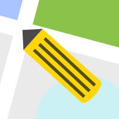

# SegMap

<div align="center">
  
</div>

## Introduction

**What is SegMap?**  

SegMap is a **QGIS plugin** that leverages deep learning (DL) models to enable fast map digitization. Unlike traditional methods requiring labor-intensive polygon editing, SegMap allows users to extract objects of interest from aerial imagery with just a few clicks. This streamlined approach makes it significantly faster and more efficient for generating precise vector outputs.  

**Traditional vector editing vs. SegMap**  

- Old Workflow: Manual digitization of aerial features often demands **hundreds** of clicks to adjust polygon vertices.  
- SegMap Advantage: Achieves accurate results in **seconds with 1-5 clicks**, reducing effort by over 90%.  

**Key Features**  

- **Rapid Interactive Vectorization**: Extract objects to vector polygons using foreground/background clicks, guided by DL models.  
- **QGIS Integration**: Functions seamlessly within the QGIS environment, combining AI power with geospatial tools.  

By merging AI efficiency with user-friendly interaction, SegMap revolutionizes tasks like land cover mapping, infrastructure monitoring, and environmental analysis.

## Supported QGIS Version

The supported and tested QGIS version for SegMap is **QGIS 3.40-Bratislava LTR**. Other versions of QGIS have not been tested and may not work as expected.

## Installation

To install SegMap as a QGIS plugin, follow these steps:

1. Download the latest release from the [releases page](https://github.com/your-repo/segmap/releases).

2. Open QGIS and navigate to `Plugins > Manage and Install Plugins...`.

3. In the Plugin Manager, click on the `Install from ZIP` tab.

4. Click the `...` button to browse and select the downloaded ZIP file.

5. Click `Install Plugin` to complete the installation.

<div align="center">
  
</div>

You are now ready to use SegMap as a QGIS plugin for your segmentation tasks!

## Usage

### Step 1: Prepare and Setup Everything

a. Click the **SegMap: Settings** button to configure the server and token. Use the demo server `https://segmap.nodes.studio` and token `demo` for quick setup. Note: The demo service is available for use, but its availability and speed are not guaranteed.

b. Click the **SegMap: Start** button to open the tool panel.

c. Choose the **Model**, **Raster**, and **Output**, and edit the **Class** list as needed.

<div align="center">
  
</div>

### Step 2: Start Using SegMap

a. Click the **Start** button to begin.

b. Use the mouse middle button or scroll to pan/zoom the image and locate the object in the center of the canvas.

c. Left-click on the desired object and right-click on unwanted areas to refine the selection.

d. When the result is satisfactory, click **Confirm** to save it to the selected vector layer.

e. Once finished, click the **End** button to exit the tool usage.

<div align="center">
  
</div>

## Self-Hosted API Server

If you prefer to deploy the API server on your own device, please refer to the [server/README.md](server/README.md) for detailed instructions.

## License

This plugin is licensed under the MIT License. You can find the full license text in the [LICENSE](LICENSE) file.

## Authors and References

### Authors

- **Shoukun Sun**
- **Zhe Wang**

### References

If you use this plugin in your work, please cite the following papers:

```
@article{cfr_icl_2024,
      title={CFR-ICL: Cascade-Forward Refinement with Iterative Click Loss for Interactive Image Segmentation},
      volume={38},
      url={https://ojs.aaai.org/index.php/AAAI/article/view/28306},
      DOI={10.1609/aaai.v38i5.28306},
      number={5},
      journal={Proceedings of the AAAI Conference on Artificial Intelligence},
      author={Sun, Shoukun and Xian, Min and Xu, Fei and Capriotti, Luca and Yao, Tiankai},
      year={2024},
      month={Mar.},
      pages={5017-5024}
}

@misc{is_aerial_2024,
      title={Interactive segmentation in aerial images: a new benchmark and an open access web-based tool}, 
      author={Zhe Wang and Shoukun Sun and Xiang Que and Xiaogang Ma},
      year={2024},
      eprint={2308.13174},
      archivePrefix={arXiv},
      primaryClass={cs.CV},
      url={https://arxiv.org/abs/2308.13174}, 
}
```
