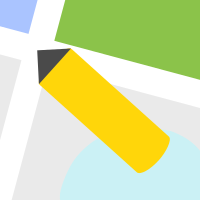

# SegMap

<p align="center">
  
  
  
</p>

 


## Table of Contents
- [Introduction](#introduction)
- [Getting Started](#getting-started)
  - [Installation](#installation)
  - [Setup](#setup)
  - [Basic Usage](#basic-usage)
  - [Keyboard Shortcuts](#keyboard-shortcuts)
- [Advanced Topics](#advanced-topics)
  - [Self-Hosted API Server](#self-hosted-api-server)
  - [Troubleshooting](#troubleshooting)
- [Project Information](#project-information)
  - [Contributing](#contributing)
  - [License](#license)
  - [Authors and References](#authors-and-references)

## Introduction

<div align="center">
  
</div>

SegMap is a **QGIS plugin** that uses deep learning to enable fast map digitization. It allows users to extract objects from aerial imagery with just a few clicks, replacing traditional labor-intensive polygon editing.

**Benefits:**
- **90% Efficiency Gain**: Complete in seconds with 1-5 clicks what traditionally requires hundreds of vertex adjustments
- **AI-Powered**: Leverages deep learning models for precise object extraction
- **QGIS Integration**: Works seamlessly within your existing GIS workflow

SegMap revolutionizes tasks like land cover mapping, infrastructure monitoring, and environmental analysis by combining AI efficiency with intuitive user interaction.

> **Compatibility Note**: SegMap is tested and supported on **QGIS 3.40-Bratislava LTR**. Other versions may not work as expected.

## Getting Started

### Installation

<div align="center">
  
</div>

1. Download the latest release from the [releases page](https://github.com/TitorX/SegMap-QGIS/releases)
2. In QGIS: `Plugins > Manage and Install Plugins... > Install from ZIP`
3. Select the downloaded ZIP file and click `Install Plugin`

### Setup

<div align="center">
  
</div>

1. Click **SegMap: Settings** to configure server and token
   - Quick start: Use demo server `https://segmap.nodes.studio` with token `demo`
2. Click **SegMap: Start** to open the tool panel
3. Select your **Model**, **Raster**, **Output**, and edit the **Class** list as needed

### Basic Usage

<div align="center">
  
</div>

1. Click **Start** to begin
2. Navigate to your target object (middle mouse button/scroll to pan/zoom)
3. Left-click on the object, right-click on background areas to refine selection
4. Click **Confirm** to save to the vector layer
5. Click **End** when finished

### Keyboard Shortcuts

- **Enter**: Start/Confirm segmentation
- **Left Arrow**: Undo last click
- **Right Arrow**: Redo click
- **Esc**: End segmentation

## Advanced Topics

### Self-Hosted API Server

For self-hosting instructions, see [server/README.md](server/README.md).

> **Privacy Notice**
>
> - Images from your canvas are sent to the server for processing but not stored
> - No user data is collected or retained after processing
> - For sensitive data, use a self-hosted server in your secure environment

### Troubleshooting

Common issues and solutions:

| Issue | Solution |
|-------|----------|
| **Plugin Loading Failure** | • Verify QGIS 3.40-Bratislava LTR<br>• Reinstall the plugin<br>• Check QGIS log panel for errors |
| **Server Connection Issues** | • Check internet connection<br>• Try again later (demo server may be down)<br>• Consider self-hosting |
| **Poor Results** | • Add more clicks to refine selection<br>• Use right-clicks to exclude unwanted areas<br>• Center the object in view<br>• Try different models |
| **Performance Issues** | • Self-host on a more powerful machine<br>• Reduce image resolution<br>• Close other resource-intensive applications |

## Project Information

### Contributing

We welcome contributions! Here's how:

- **Report Issues**: Use GitHub issue tracker with detailed steps and screenshots
- **Develop**: Fork, branch, code, test, and submit pull requests
- **Document**: Improve docs, create translations, or develop tutorials

All contributions are licensed under GPL-3.0.

### License

GPL-3.0 License. See [LICENSE](LICENSE) file for details.

### Authors and References

**Authors**: Shoukun Sun, Zhe Wang

**Citations**:

```
@article{cfr_icl_2024,
      title={CFR-ICL: Cascade-Forward Refinement with Iterative Click Loss for Interactive Image Segmentation},
      volume={38},
      url={https://ojs.aaai.org/index.php/AAAI/article/view/28306},
      DOI={10.1609/aaai.v38i5.28306},
      number={5},
      journal={Proceedings of the AAAI Conference on Artificial Intelligence},
      author={Sun, Shoukun and Xian, Min and Xu, Fei and Capriotti, Luca and Yao, Tiankai},
      year={2024},
      month={Mar.},
      pages={5017-5024}
}

@misc{is_aerial_2024,
      title={Interactive segmentation in aerial images: a new benchmark and an open access web-based tool}, 
      author={Zhe Wang and Shoukun Sun and Xiang Que and Xiaogang Ma},
      year={2024},
      eprint={2308.13174},
      archivePrefix={arXiv},
      primaryClass={cs.CV},
      url={https://arxiv.org/abs/2308.13174}, 
}
```
